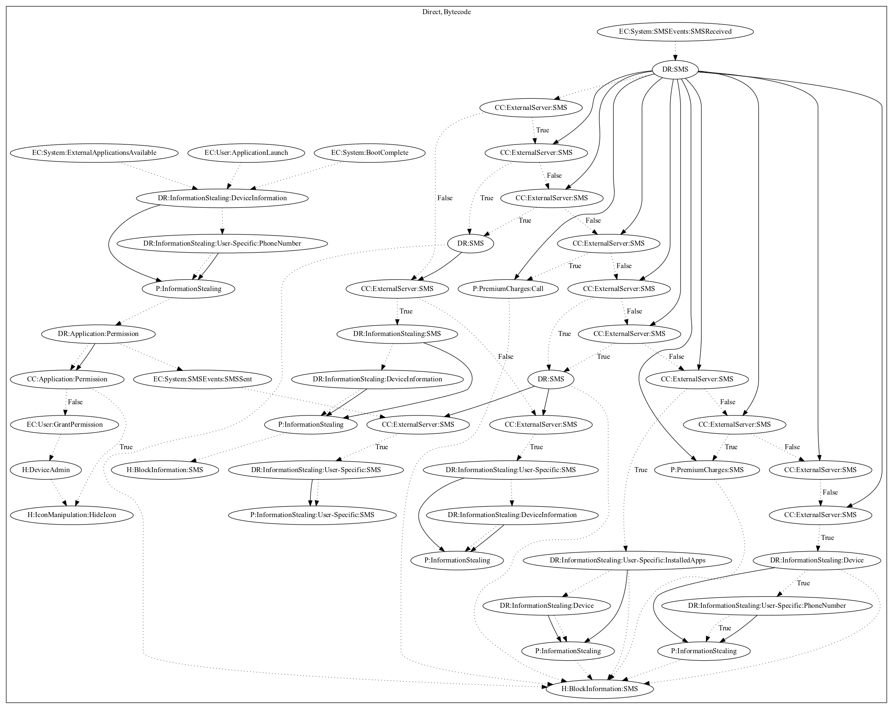

# AceCard

## High-level Description

* Year: 2016
* Blog: https://securelist.com/the-evolution-of-acecard/73777/

This malware attempts to perform a series of information stealing or premium charge payloads depending on commands from received as SMS messages. On application launch and system events (external applications available, boot complete), it first leaks the phone number of the device to the malware developer. It then attempts to grant device admin privileges to prevent uninstallation, and registers a content observer to leak SMS messages sent by the user on command. To retrieve the commands, it listens on SMS received system events. If a command is found, it can set flags used to control the malicious behaviors of the app, perform premium charges (via sms or call), or leak device and user-specific information. It should be noted that when a command is sent to the device, it is intercepted and hidden from the user to avoid suspicion.

## Signature
---

The image of the signature can be downloaded [here](../../img/signatures/AceCard.png) for closer inspection.

