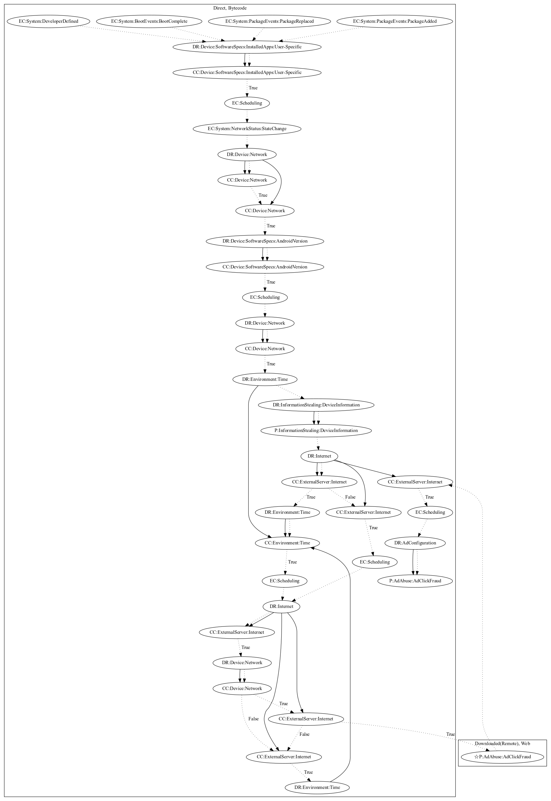

# AdloadNL

## High-level Description

* Year: 2017
* Blog: https://nakedsecurity.sophos.com/2017/06/05/punching-down-the-judy-android-malware-a-sophoslabs-analysis/

This malware attempts to perform ad click fraud. It is registered on system events (Boot Complete, Package Added, Package Removed, Package Replaced, Developer Defined). It contacts the server to retrieve ad information. It then uses an invisible webview that sets a javascript interface, webviewclient, and webchromeclient that work together to load web pages. Upon the page finishing, it checks whether the web page contains a certain element (based on internet data) and runs javascript payloads to perform ad click fraud (an observed behavior, as the server that was used to retrieve the javascript code was down at time of analysis). It further contains interfaces that can also perform random clicks in bytecode based on calling a javascript interface. Thus it is likely that the malware performs clicks using remote javascript code that can also call the interface to perform clicks in bytecode as well.

## Signature
---

The image of the signature can be downloaded [here](../../img/signatures/AdloadNL.png) for closer inspection.

