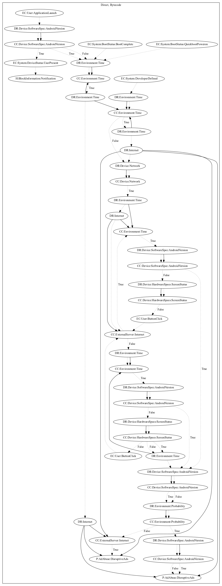

# AdQR

## High-level Description

* Year: 2021
* Blog: https://blog.malwarebytes.com/android/2021/02/barcode-scanner-app-on-google-play-infects-10-million-users-with-one-update/

This malware sample aims to run full screen ads using libraries or a browser. It is triggered on application launch and various system events (developer defined firebase push notifications and boot complete events). Interestingly, this sample is heavily obfuscated, and contains complex computations most likely to prevent analysis tools from running the app (ex. tools which perform symbolic execution would fail). Additionally, this malware sample stores strings by concatenating based on functions, each representing one character at a time.

## Signature
---

The image of the signature can be downloaded [here](../../img/signatures/AdQR.png) for closer inspection.

