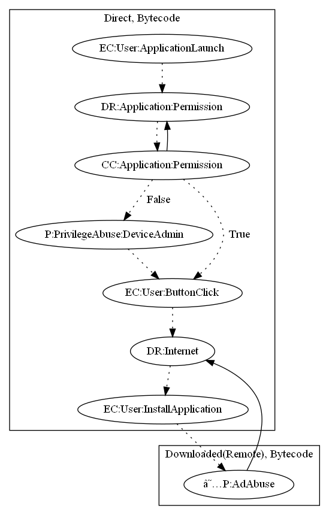

# AgentJL

## High-level Description

* Year: 2017
* Blog: https://www.welivesecurity.com/2017/03/23/download-minecraft-mods-google-play-read/

This malware sample acts as a malware dropper. The sample requests device admin privileges on application launch. Once the user clicks on a button, the app downloads an remote payload and attempts to convince the user to install it for the apps functionality (minecraft mods) to work. The user clicks on the dialog, installs the app, and the remote payload performs ad click fraud (an observed behavior).

## Signature
---

The image of the signature can be downloaded [here](../../img/signatures/AgentJL.png) for closer inspection.

