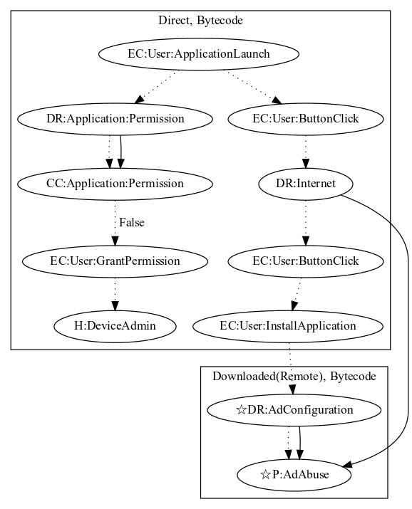

# AgentJL

## High-level Description

* Year: 2017
* File Hash (SHA-256): e3c83bb1acb4c2132cce2c849fa98a336593825746d44aa20ea2c2beb86c003b
* Blog: https://www.welivesecurity.com/2017/03/23/download-minecraft-mods-google-play-read/

This malware sample acts as a minecraft loader. Behind the scenes, the malware contains the ability to download and entice a user to install another APK which performs an ad abuse payload. On launch, the application checks whether device admin privileges are enabled and, if not provided, requests the privileges. Once the user clicks on a button labelled "Install", the user is prompted with a dialog describing a secondary application to "load minecraft mods". Once the user accepts installation, the secondary payload performs ad abuse.

## Signature
---

