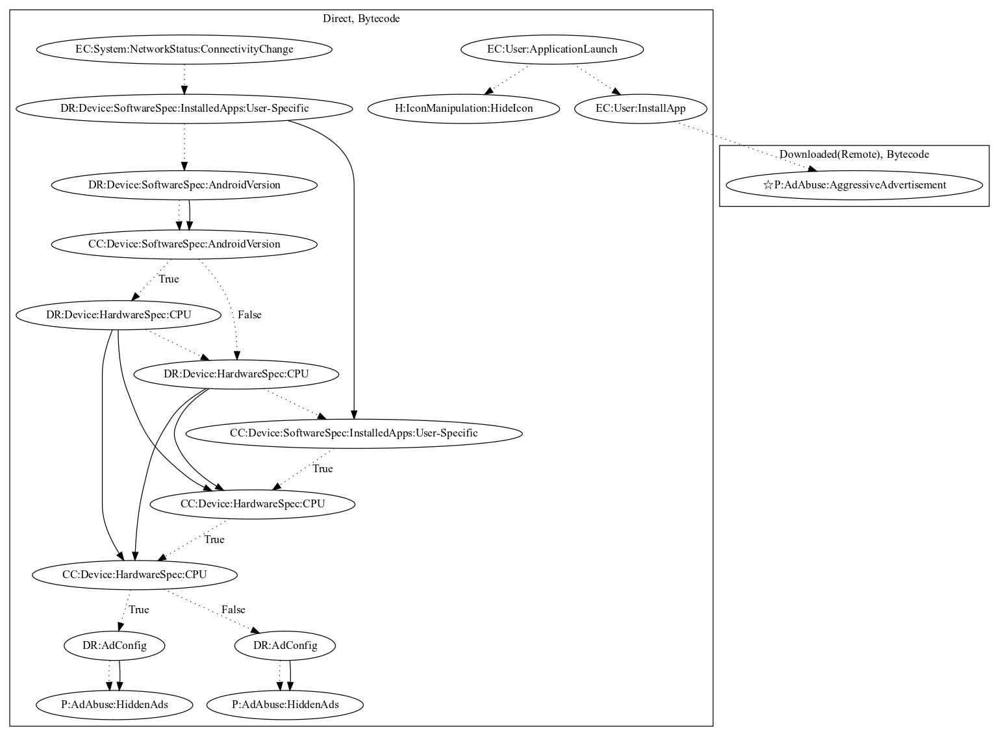

# Aladdin

## High-level Description

* Year: 2018
* Blog: https://www.symantec.com/blogs/threat-intelligence/hidden-app-malware-google-play

This malware application attempts to install an additional payload that performs ad abuse (disruptive ads). Upon launching the application, it opens Google Play Store hoping the user will install another application and hides itself. It also listens on connectivity change events to start a service. This service opens up web pages if: (1) user-specific apps are not installed, and (2) the phone has a set number of CPU cores. It will then load a webview in the background hidden to the user (as it is in a service). Depending on the number of CPU cores, it will load different websites to perform ad abuse payloads (hidden ads).

## Signature
---

The image of the signature can be downloaded [here](../../img/signatures/Aladdin.png) for closer inspection.

