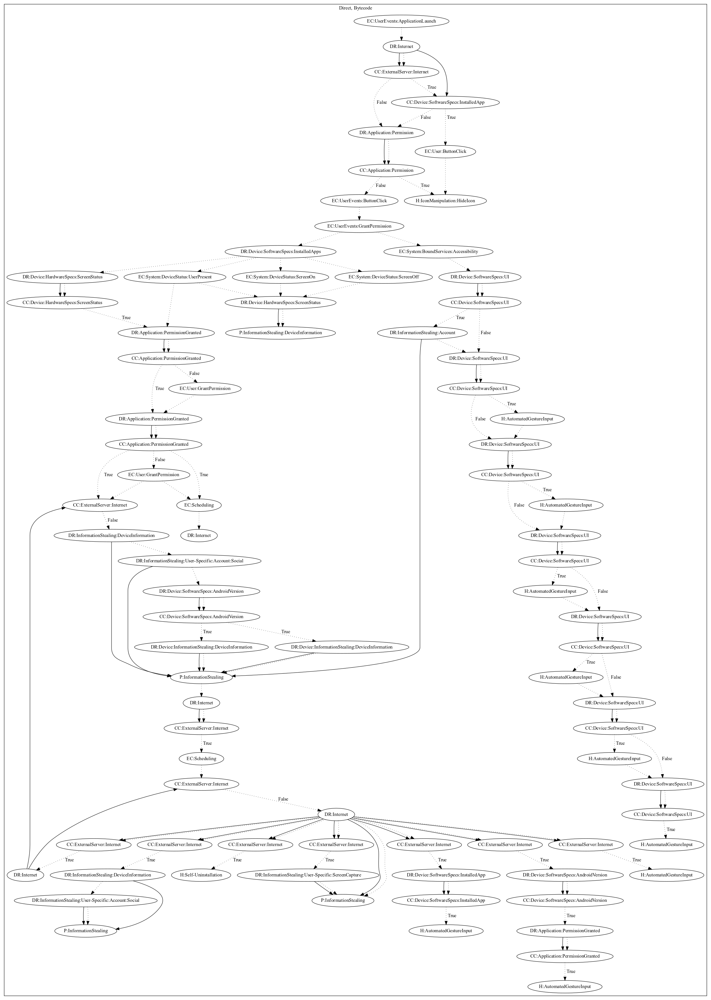

# AndroidOSBrata

## High-level Description

* Year: 2019
* Blog: https://securelist.com/spying-android-rat-from-brazil-brata/92775/

This malware sample aims to perform a series of malicious behaviors based on commands sent from the C&C server. It abuses accessibility permissions to perform the following actions: start/stop screen recording, turn on/off the screen, leak device information, launch an application, uninstall the app, keylog strokes/screen of the user.

## Signature
---

The image of the signature can be downloaded [here](../../img/signatures/AndroidOSBrata.png) for closer inspection.

