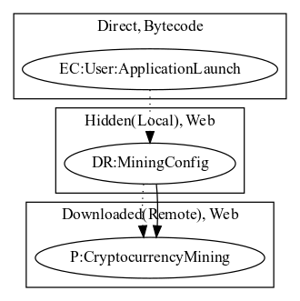

# AndroidOSJSMiner

## High-level Description

* Year: 2017
* Blog: https://blog.trendmicro.com/trendlabs-security-intelligence/coin-miner-mobile-malware-returns-hits-google-play/

This malware sample aims to perform cryptocurrency mining. The malware sample reads and loads a hardcoded javascript payload on launching the application.

## Signature
---

The image of the signature can be downloaded [here](../../img/signatures/AndroidOSJSMiner.png) for closer inspection.

