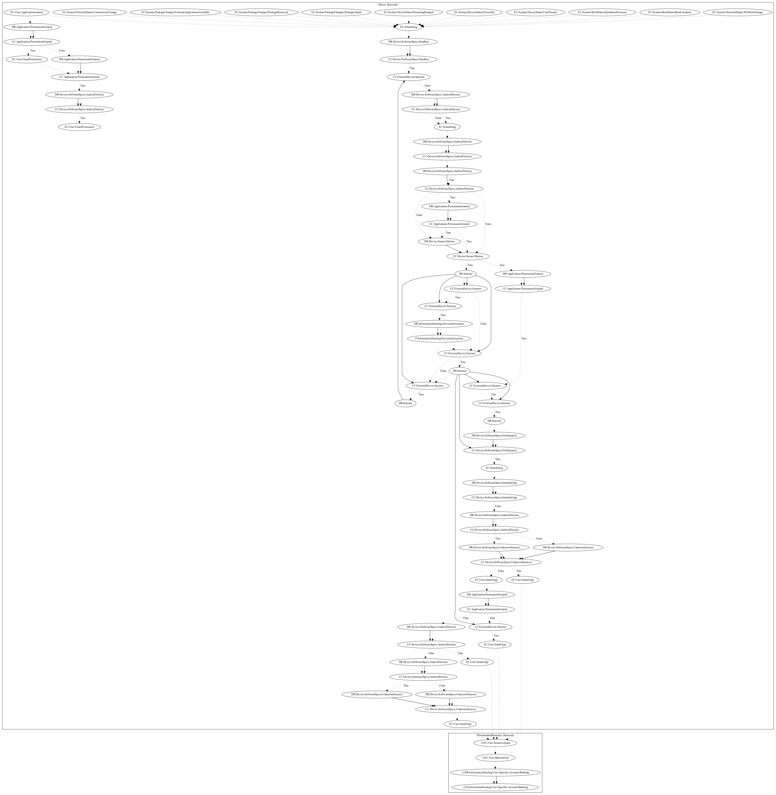

# AnubisDropper

## High-level Description

* Year: 2019
* Blog: https://blog.trendmicro.com/trendlabs-security-intelligence/google-play-apps-drop-anubis-banking-malware-use-motion-based-evasion-tactics/

This malware sample aims to steal information from the user. The malware sample schedules a task on a variety of network events (Wifi State Change, Connectivity Change), package events (External Applications Available, Package Removed, Package Added), device status (Screen On, Dreaming Stopped, User Present), and boot events (Boot Complete, Quickboot Poweron). It then checks to ensure the device is a user based on sandbox detection and data retrieved from motion sensors. The malware sample downloads an executable. The sample then requests installation if unknown sources is checked. Otherwise, it visits a secondary activity that attempts to entice the user to install the application (e.g., claiming a system update is needed) before attempting installation. The downloaded executable aims to steal SMS messages (an observed behavior, as the server was down).

## Signature
---

The image of the signature can be downloaded [here](../../img/signatures/AnubisDropper.png) for closer inspection.

