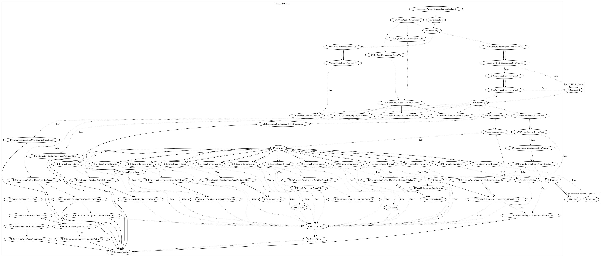

# AnubisSpy

## High-level Description

* Year: 2017
* Blog: https://blog.trendmicro.com/trendlabs-security-intelligence/cyberespionage-campaign-sphinx-goes-mobile-anubisspy/

This malware aims to exploit root privileges and steal device/user-specific information from the user. On application launch, the malware registers system events (screen on and screen off) to save the current screen status. It also schedules routines to hide the app icon and checks if the device has been rooted. If so, it attempts to overwrite the configuration that is used to often restrict rooted devices (superSU) to grant the app with full privileges. It then schedules multiple actions that aim to collect database information (querying databases such as contacts or specific apps such as facebook), take screen shots, and retrieve/perform commands from the malware developers server. Commands include: (1) self-uninstallation, (2) leaking stored files to the internet, (3) leaking database files, (4) capture and leak the current screen, (5) download and store files from the internet, (6) run commands into terminal.

## Signature
---

The image of the signature can be downloaded [here](../../img/signatures/AnubisSpy.png) for closer inspection.

