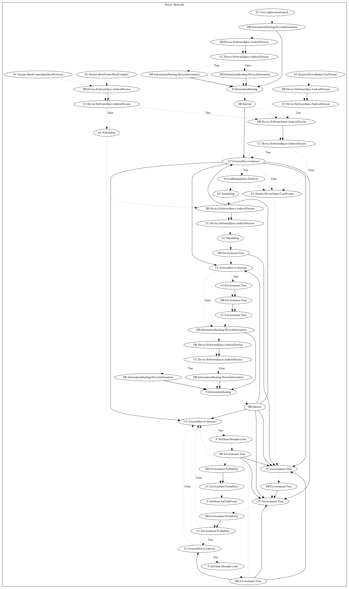

# Ashas

## High-level Description
* Year: 2019
* Blog: https://www.welivesecurity.com/2019/10/24/tracking-down-developer-android-adware/

This malware application aims to perform push ads disruptively to the user. The malware leaks device information and retrieves ad configuration from the C&C server on launching the application. The malware also checks the ip of the device to ensure the device is not under a Google domain. On various system events (boot complete and quickboot power on) the malware schedules the routine to perform ad abuse. This routine is also run when the device is unlocked (user present). It then performs a series of checks based on the android version, time, and configuration from the server, before pushing ads disruptively to the user. In addition, it performs a probability roll to check whether the app should perform ad click fraud on top the disruptive ad.

## Signature
---

The image of the signature can be downloaded [here](../../img/signatures/Ashas.png) for closer inspection.

