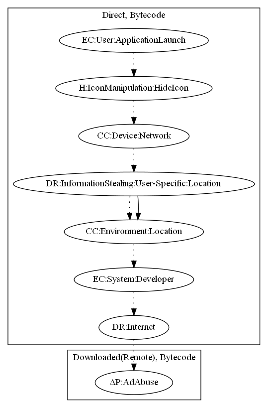

# AsiaHitGroup

## High-level Description

* Year: 2017
* Blog: https://blog.malwarebytes.com/cybercrime/2017/11/new-trojan-malware-discovered-google-play/

This malware attempts to download a remote payload that performs SMS stealing behaviors (observed). On application launch, it initially contacts a C&C server. Based on the response, it will check for network connectivity, contact a internet location service to check whether the user is in a valid target location, and then download an additional remote payload. It then broadcasts a developer defined intent that is picked up in a second entry point to virtually install and run the remote payload.

## Signature
---

The image of the signature can be downloaded [here](../../img/signatures/AsiaHitGroup.png) for closer inspection.

