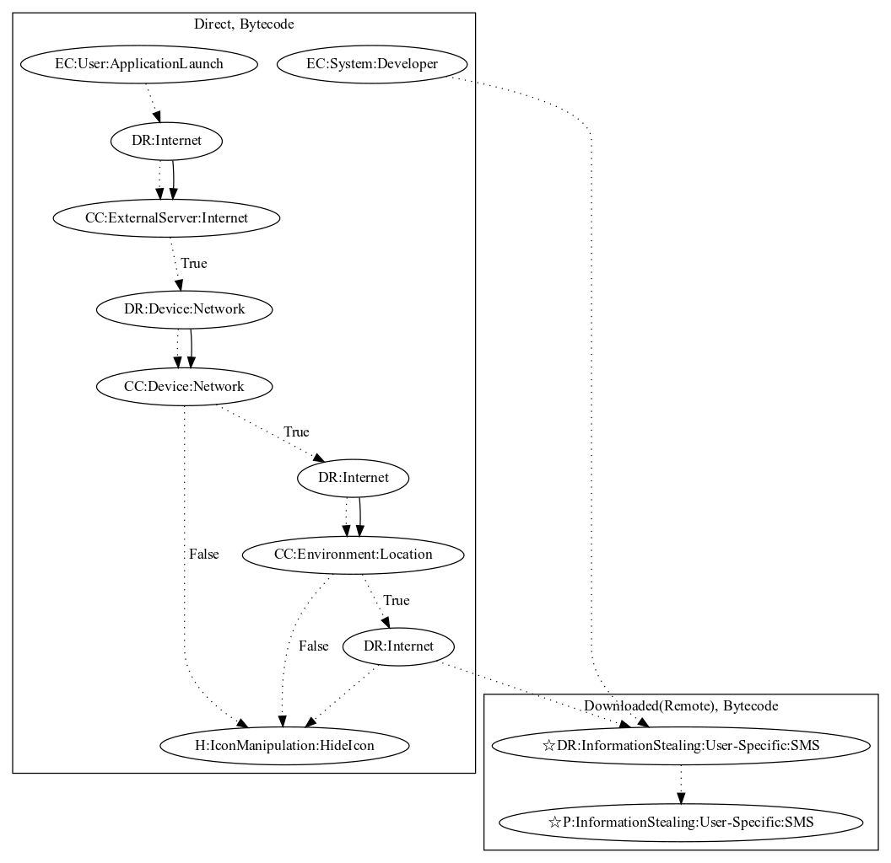

# AsiaHitGroup

## High-level Description

* Year: 2017
* File Hash (SHA-256): e45cd99a664c5bb68ea7ab8e8f47f329bd01dc1193106e25962478b5259c0009
* Blog: https://blog.malwarebytes.com/cybercrime/2017/11/new-trojan-malware-discovered-google-play/

This malware sample aims to download an additional application to perform an ad abuse payload. On launching the application, the malware hides its icon, checks network connectivity, and collects location information to target specific regions of the world. Afterwards, the malware runs a developer defined intent and downloads an APK from an online server. Lastly, the APK is virutally installed and run on the users device to perform an ad abuse payload.

## Signature
---

