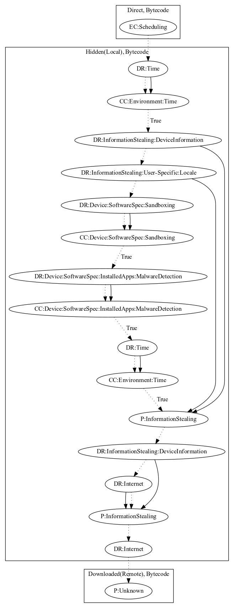

# AxentDS

## High-level Description

* Year: 2017
* Blog: https://nakedsecurity.sophos.com/2017/05/02/super-free-music-player-in-google-play-is-malware-a-technical-analysis/

This malware sample decrypts a local payload to perform malicious behaviors. It first checks whether a set time has past before collecting device and user-specific information. It then checks whether the device is a sandboxed using common emulator indicators and whether the app contains malware detection apps installed on the device (e.g., TaintDroid). It then leaks additional information to a second server and downloads a remote payload, which it then invokes to perform unknown behaviors.

## Signature
---

The image of the signature can be downloaded [here](../../img/signatures/AxentDS.png) for closer inspection.

