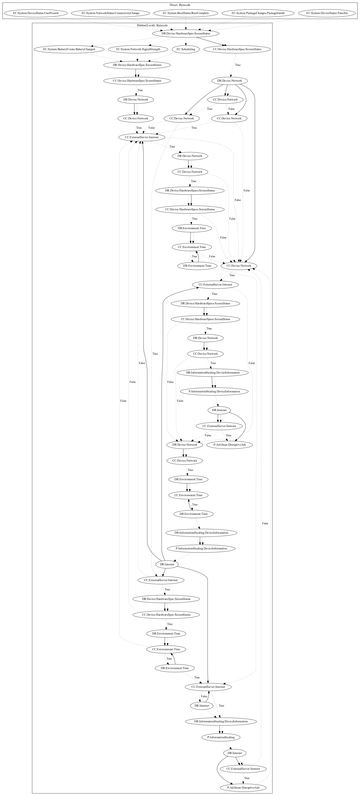

# AxentEH

## High-level Description

* Year: 2017
* Blog: https://nakedsecurity.sophos.com/2017/05/30/why-you-should-avoid-star-hop-and-candy-link-in-google-play/

This malware sample aims to display full screen ads to the user. It listens on a variety of system-wide events (user present, boot complete, package install, connectivity change), then checks that the network and screen is on. It then decrypts and loads a local payload which, after a series of network, screen, and time checks, retrieves ad configuration from the internet and pushes ads disruptively to the user.

## Signature
---

The image of the signature can be downloaded [here](../../img/signatures/AxentEH.png) for closer inspection.

