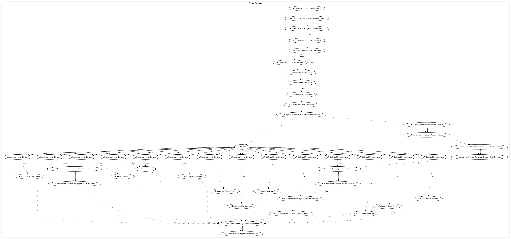

# BanBraA

## High-level Description

* Year: 2020
* Blog: https://www.welivesecurity.com/2020/05/22/insidious-android-malware-gives-up-all-malicious-features-but-one-gain-stealth/

This malware application abuses accessibility permissions to steal information from the user. On launching, it requests that the user grants accessibility permissions. Once the app retrieves the related permissions, it registers to the malware developer's firebase database (and leaks the device id) which schedules commands. Based on the commands, it can leak the apps installed packages and record the app screen. This sample further contains the capability to perform automated gestures and can self-uninstall.

## Signature
---

The image of the signature can be downloaded [here](../../img/signatures/BanBraA.png) for closer inspection.

