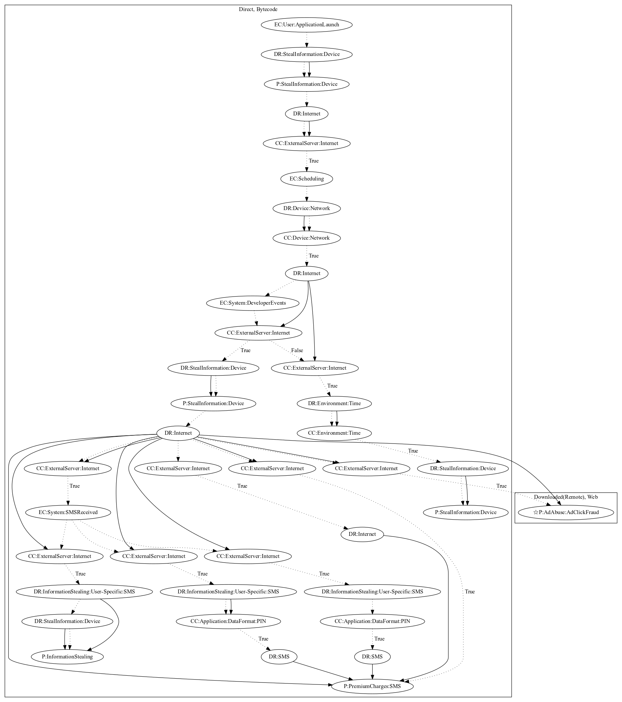

# BKotlindHRX

## High-level Description

* Year: 2018
* File Hash (SHA-256): 621092856e20e628a577dbe9248649eae78d1af611d9168635b22057c6c7552b
* Blog: https://blog.trendmicro.com/trendlabs-security-intelligence/first-kotlin-developed-malicious-app-signs-users-premium-sms-services/, https://blog.malwarebytes.com/cybercrime/mobile/2018/02/mobile-menace-monday-first-kotlin-developed-malicious-app/

This malware sample aims to load a payload which performs premium charges based on WAP Billing. On launching the application, device information (Ex., Device ID) is leaked to the server. The network connectivity of the device is checked, and a payload with commands are retrieved from the server. Lastly, the app checks whether a certain amount of time has passed before loading the payload to perform premium charges.

## Signature
---

