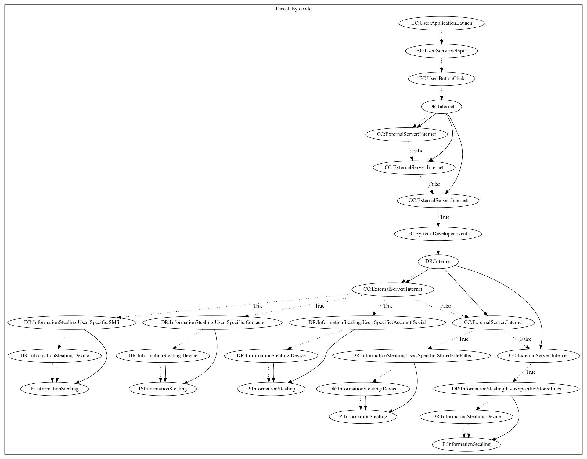

# ChatSpyA

## High-level Description

* Year: 2017
* Blog: https://blog.trendmicro.com/trendlabs-security-intelligence/deciphering-confucius-cyberespionage-operations/

This malware sample aims to steal user-specific information from the user. The user logs into the application by performing a series of sensitive input and button clicks. The malware sample uses firebase cloud messaging services to retrieve commands from the server. The malware then can steal device and user-specific information (e.g., SMS, Contacts, Social Accounts, Stored Files) based on the commands and leak them to the malware developer's server.

## Signature
---

The image of the signature can be downloaded [here](../../img/signatures/ChatSpyA.png) for closer inspection.

