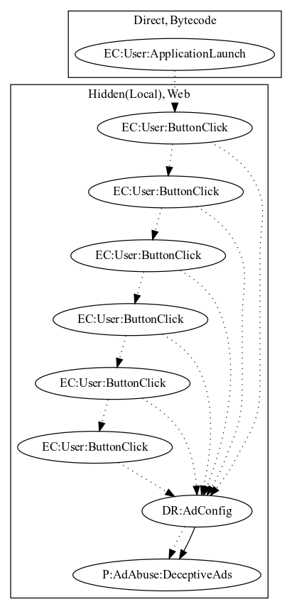

# ClickAds

## High-level Description

* Year: 2018
* Blog: https://www.symantec.com/blogs/threat-intelligence/apps-containing-aggressive-adware-found-google-play

This malware sample acts as a tutorial slider application, containing 7 slides in total. The sample loads ads on every click the user performs.

## Signature
---

The image of the signature can be downloaded [here](../../img/signatures/ClickAds.png) for closer inspection.

