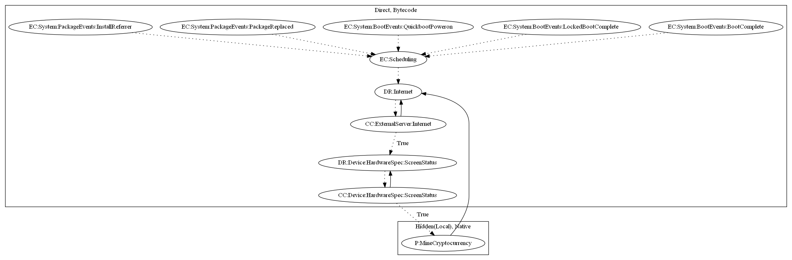

# CoinMinerQ

## High-level Description

* Year: 2018
* Blog: https://www.welivesecurity.com/2018/02/28/cryptocurrency-scams-android/

This malware application aims to mine cryptocurrency. The malware listens on boot and package related system events to schedule an alarm that runs periodically. The sample retrieves mining configuration and commands from the internet. Once the screen is off, it then loads a native library to mine cryptocurrency.

## Signature
---

The image of the signature can be downloaded [here](../../img/signatures/CoinMinerQ.png) for closer inspection.

