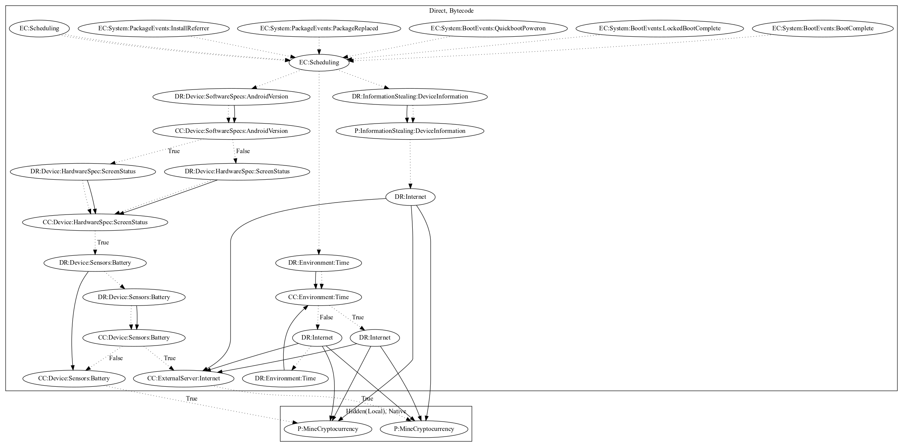

# CoinMinerQ

## High-level Description

* Year: 2018
* File Hash (SHA-256): aabb57bf1f492c9a3b9c43109b89d5b691b7250e569a1589d1be4e8bf7a80820
* Blog: https://www.welivesecurity.com/2018/02/28/cryptocurrency-scams-android/

This malware application aims to mine cryptocurrency. The malware listens on boot and package related system events to schedule an alarm that runs periodically. Mining configuration and commands are retrieved from the internet, and once the screen is off, the malware loads a native library to mine cryptocurrency.

## Signature
---

