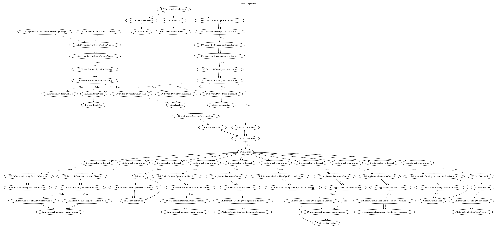

# DoubleHidden

## High-level Description

* Year: 2017
* Blog: https://www.symantec.com/blogs/threat-intelligence/doublehidden-android-malware-google-play

This malware sample aims to push full screen ads to the user, steal user-specific information. The sample requests device admin privileges, and immediately hides its icon upon application launch. After a set period of time has past, it retrieves commands from the server that can perform a wide variety of commands including leaking a wide variety of device information (split among multiple commands), leaking installed apps of the device, stealing location information of the user, and stealing social accounts of the user.

## Signature
---

The image of the signature can be downloaded [here](../../img/signatures/DoubleHidden.png) for closer inspection.

