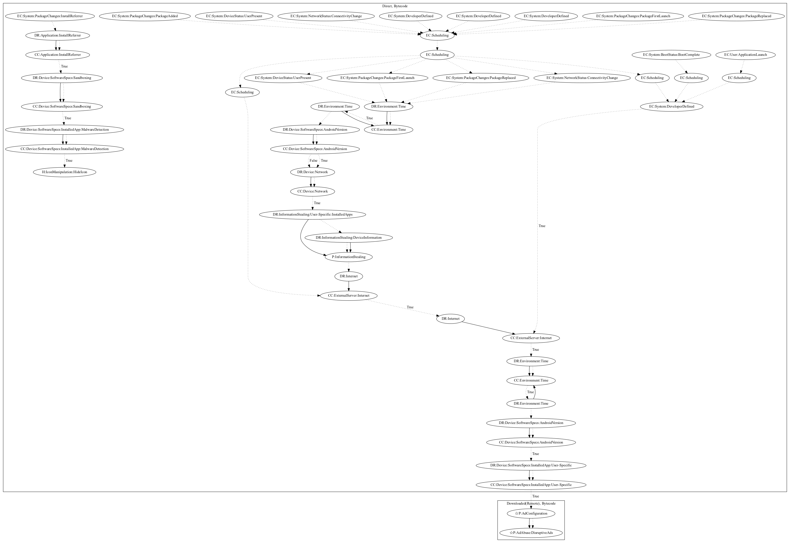

# DroidPlugin

## High-level Description

* Year: 2017
* Blog: https://unit42.paloaltonetworks.com/unit42-new-trend-android-adware-abusing-android-plugin-frameworks/

This malware sample abuses virtualization technologies to install applications for monetary gain. The malware sample collects commands to download additional APK files on various package events (Package First Launch, Package Added, Package Replaced), network events (Connectivity Change), developer defined events, and device status events (User Present). It then schedules multiple threads that work together to download applcations and virtually install them on the device. In addition, the malware contains capabilities to hide the app icon if the app contains a specific install referrer and passes sandboxing checks. 

## Signature
---

The image of the signature can be downloaded [here](../../img/signatures/DroidPlugin.png) for closer inspection.

