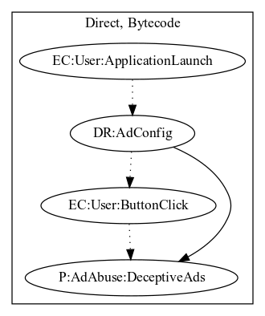

# FakeApp

## High-level Description

* Year: 2016
* Blog: https://www.welivesecurity.com/2016/08/15/quadrooter-unfortunately-cant-patched-now/

This application acts as a fake quadrooter patching app. It contains a button that "patches" the vulnerability. Upon pressing the button, the app displays a fake spinner loading animation and displays full screen ads.

## Signature
---

The image of the signature can be downloaded [here](../../img/signatures/FakeApp.png) for closer inspection.

