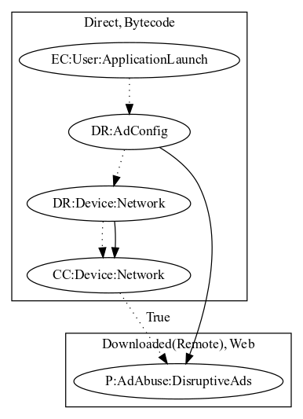

# FakeAppCQ

## High-level Description

* Year: 2016
* Blog: https://www.welivesecurity.com/2016/07/15/pokemon-go-hype-first-lockscreen-tries-catch-trend/

This malware application aims to open up web pages based on local configuration. The browser displays random websites, aiming to display ads disruptively to the user in a web browser.

## Signature
---

The image of the signature can be downloaded [here](../../img/signatures/FakeAppCQ.png) for closer inspection.

