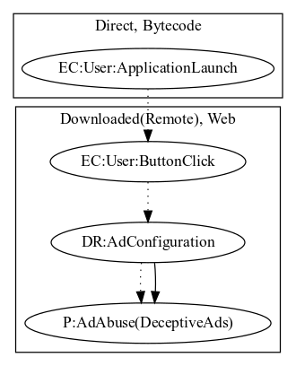

# FakeAppFG

## High-level Description

* Year: 2017
* Blog: https://www.welivesecurity.com/2017/03/23/download-minecraft-mods-google-play-read/

This malware application immediately opens a scam link on launching the application (an observed behavior, as the scam site was down). User-specific information is leaked as a result.

## Signature
---

The image of the signature can be downloaded [here](../../img/signatures/FakeAppFG.png) for closer inspection.

