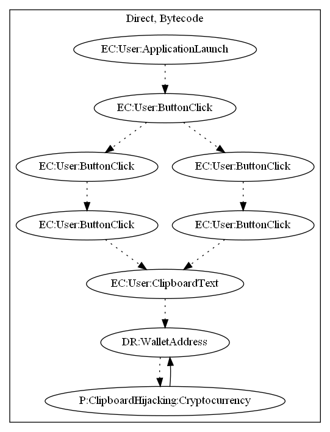

# FakeAppHZ

## High-level Description

* Year: 2018
* Blog: https://www.welivesecurity.com/2018/02/28/cryptocurrency-scams-android/

This malware application acts as a wallet generator, but aims to hijack the clipboard. On launch of the application, the user clicks through an assortment of buttons to create a wallet address. At the end, the user clicks a button to copy the generated wallet. Unfortunately to the user, the copied text is actually the malware developer's cryptocurrency wallet. Any cryptocurrency transactions performed go to the malware developer.

## Signature
---

The image of the signature can be downloaded [here](../../img/signatures/FakeAppHZ.png) for closer inspection.

