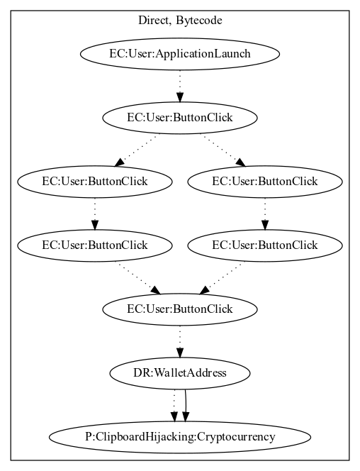

# FakeAppHZ

## High-level Description

* Year: 2018
* File Hash (SHA-256): 3b76aad2a56f16b0ae674bc90d5e5cb7e70c216c8e76a56f3b333c991ad3ada7
* Blog: https://www.welivesecurity.com/2018/02/28/cryptocurrency-scams-android/

This malware application acts as a wallet generator, but aims to hijack the clipboard. On launching the application, the user clicks through an assortment of buttons to create a wallet address. At the end, the user clicks a button to copy the generated wallet. Unfortunately to the user, the copied text is actually the malware developers cryptocurrency wallet -- any transactions performed with the wallet are stolen by the malware developer.

## Signature
---

