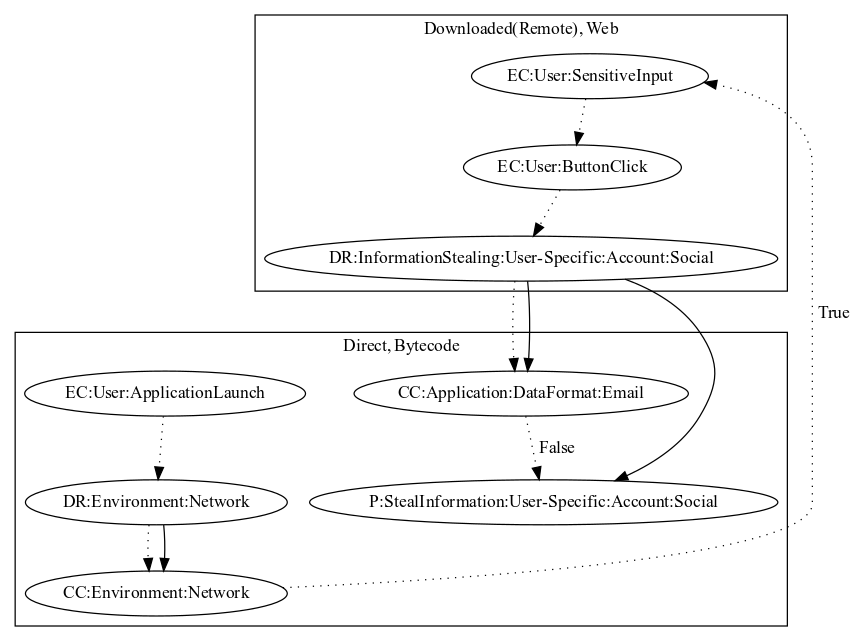

# FakeInsta

## High-level Description

* Year: 2019
* Blog: https://blog.malwarebytes.com/cybercrime/2019/04/instagram-password-stealing-apps-found-on-google-play/

This malware application opens a fake instagram login page to phish social account credentials from the user. On launch of the application, the sample opens a web page to the user. The user logs into the web page, and once the page finishes, the credentials are checked in bytecode to ensure the format is correct before leaking it to the malware developers server.

## Signature
---

The image of the signature can be downloaded [here](../../img/signatures/FakeInsta.png) for closer inspection.

