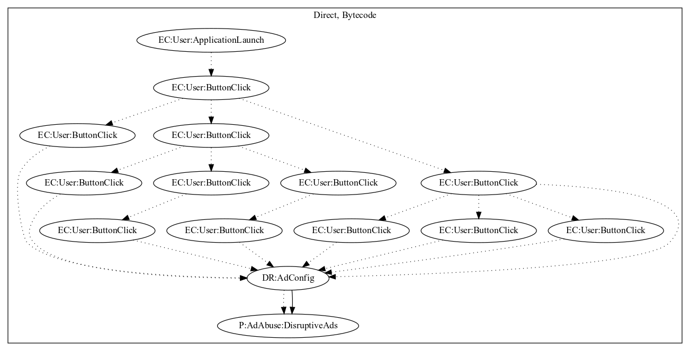

# FakeWhatsApp

## High-level Description

* Year: 2018
* Blog: https://www.welivesecurity.com/2018/02/28/cryptocurrency-scams-android/

This malware application acts as a set of tutorial slides to show how to install WhatsApp. When the user clicks on functionality throughout the application (tutorial pages, about pages, etc.) and clicks out of the page, ads are disruptively pushed to the user.

## Signature
---

The image of the signature can be downloaded [here](../../img/signatures/FakeWhatsApp.png) for closer inspection.

