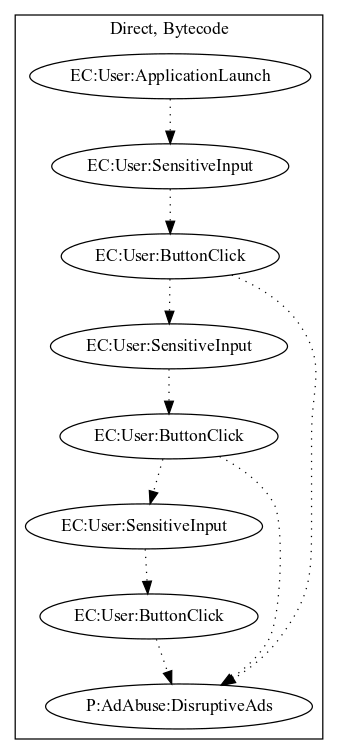

# Fasurke

## High-level Description

* Year: 2017
* Blog: https://www.welivesecurity.com/2016/07/14/fake-apps-google-play-tricked-users-paying-instead-delivering-promised-followers/

This malware application acts as a fake camera spying application. An ad is annoyingly pushed to the user every time the user clicks on the screen.

## Signature
---

The image of the signature can be downloaded [here](../../img/signatures/Fasurke.png) for closer inspection.

