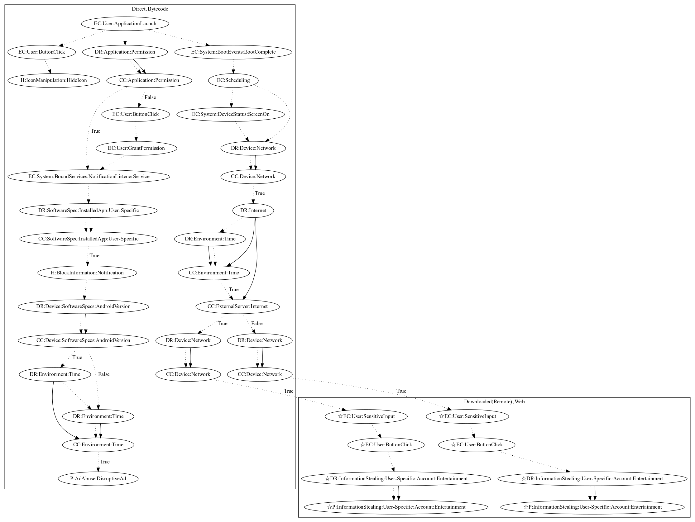

# FlixOnline

## High-level Description

* Year: 2021
* Blog: https://blog.checkpoint.com/2021/04/07/autoreply-attack-new-android-malware-found-in-google-play-store-spreads-via-malicious-auto-replies-to-whatsapp-messages/, https://research.checkpoint.com/2021/new-wormable-android-malware-spreads-by-creating-auto-replies-to-messages-in-whatsapp/, https://blogs.blackberry.com/en/2021/04/threat-thursday-flixonline-fake-application-masquerades-as-netflix-app

This malware sample aims to steal entertainment credentials from the user and advertise itself via notifications. It requests notification listener service permissions on launching the application. Upon retrieving notifications, it checks whether the app notification is from whatsapp and sends a message to the sender to advertise the malware. In addition, the malware registers on boot events that open phishing pages in web to steal entertainment account credentials from the user (an observed behavior, as the server was down at time of analysis). Lastly, the app attempts to hide itself once the user clicks a button on app launch.

## Signature
---

The image of the signature can be downloaded [here](../../img/signatures/FlixOnline.png) for closer inspection.

