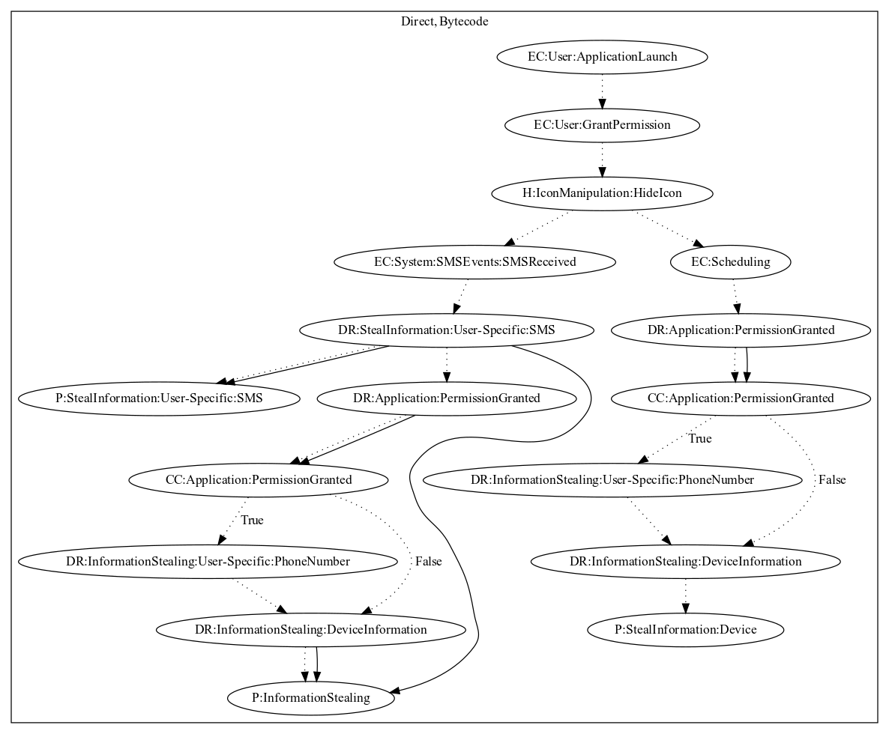

# FlokiSpy

## High-level Description

* Year: 2018
* Blog: https://blog.trendmicro.com/trendlabs-security-intelligence/fake-banking-app-found-on-google-play-used-in-smishing-scheme/

This malware application aims to steal device and user-specific information. On launch of the application, the malware sample hides its icon. It then schedules two events. The first dynamically registers a receiver on SMS received system-wide events. Once the user receives an SMS, the sample leaks the SMS contents by text. It further leaks the sms message along with device information through the internet. Secondly, it schedules a thread that periodically leaks device information to the malware developers server.

## Signature
---

The image of the signature can be downloaded [here](../../img/signatures/FlokiSpy.png) for closer inspection.

