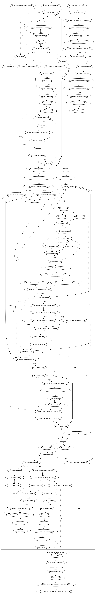

# GhostTeam

## High-level Description

* Year: 2018
* Blog: https://blog.trendmicro.com/trendlabs-security-intelligence/ghostteam-adware-can-steal-facebook-credentials/

This malware sample aims to perform privilege abuse, ad-click fraud, and download a remote payload to steal user information. On application launch, the malware requests a series of permissions used to perform the malicious behaviors. Upon application launch, boot and developer-defined system events, it first checks whether commands have been retrieved from the server. If not, the malware contacts the server to retrieve the commands. The malware dynamically registers screen on and screen off system events to repeatedly check this process. Afterwards, the malware contains a wide variety of time checks before leaking device information. The malware contains additional time checks and screen checks before performing ad-click fraud. Lastly, the malware performs additional time checks and displays different messages to entice the user to install an application (e.g., fake system update if device has google play services/youtube installed). The downloaded payload requests device admin privileges and attempts to open phishing pages to steal social account credentials (both observed behaviors, as the server used to download the payload was down at time of analysis).

## Signature
---

The image of the signature can be downloaded [here](../../img/signatures/GhostTeam.png) for closer inspection.

