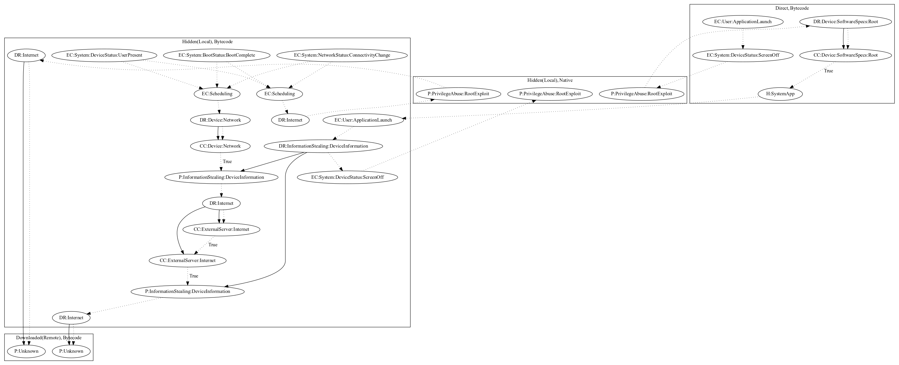

# Godless

## High-level Description

* Year: 2016
* Blog: https://blog.trendmicro.com/trendlabs-security-intelligence/godless-mobile-malware-uses-multiple-exploits-root-devices/

This malware sample aims to perform root exploits and perform an additional unknown payload. The malware sample runs native asset files to perform root exploits. It then mounts a local payload as a system app. The local payload registers device status events, boot events, and network status events, to perform a root exploit routine (the same root exploit routine from the original malware sample), steal device information from the user, and download/install additional unknown payloads.

## Signature
---

The image of the signature can be downloaded [here](../../img/signatures/Godless.png) for closer inspection.

