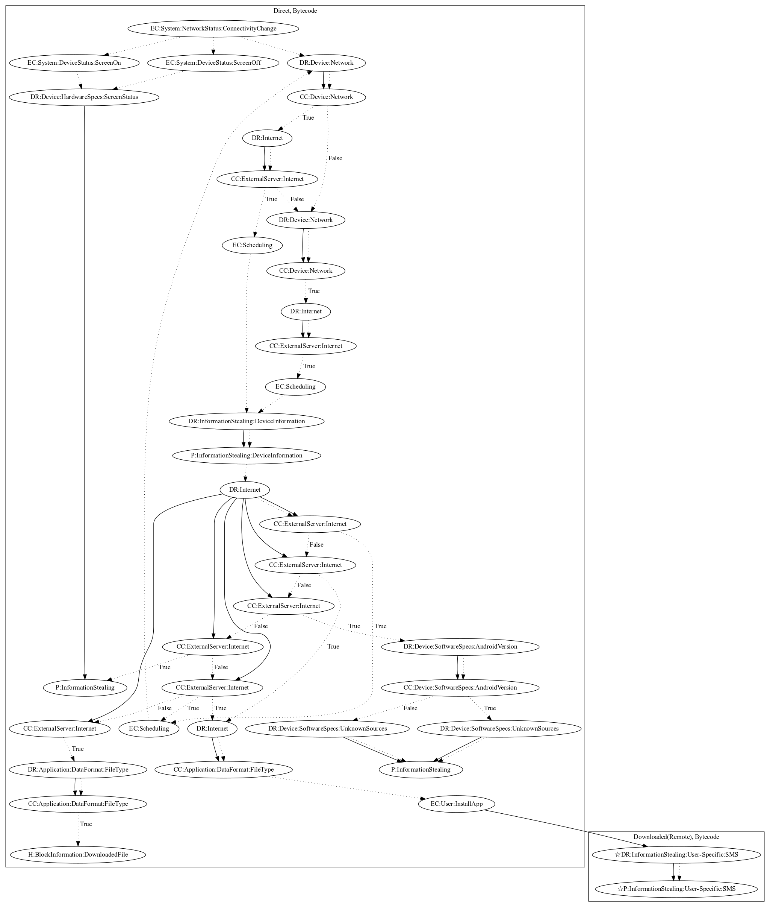

# GoldenCup

## High-level Description

* Year: 2018
* Blog: https://securingtomorrow.mcafee.com/other-blogs/mcafee-labs/google-play-users-risk-a-yellow-card-with-android-foulgoal-a/

This malware sample aims to steal information from the user. It first retrieves commands and an executable from the malware developer's server. The executable then sends SMS and device information to the malware developer's server (an observed behavior, as the server to retrieve the executable was down).

## Signature
---

The image of the signature can be downloaded [here](../../img/signatures/GoldenCup.png) for closer inspection.

