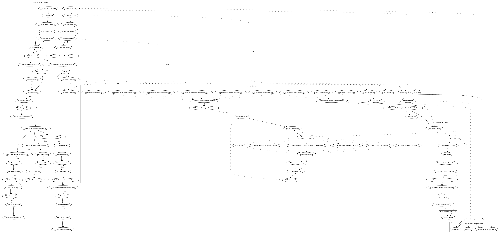

# Gooligan

## High-level Description

* Year: 2017
* Blog: https://www.kaspersky.com/blog/ztorg-botnet/16914/

This malware application aims to root the device, display inappropriate advertisement to the user, and install additional remote payloads to the user. On launch of the application and various system events, device and user-specific information is leaked to the malware developer. It then attempts to root the device locally. If not successful, it will contact the server to download additional root exploits (an observed behavior as the server was down at time of analysis). Afterwards, it downloads and executes a remote payload. The app additionall loads a local payload which hides the app icon. After set time periods, it changes the app icon to an installed app the user is currently running in the foreground and pushes inappropriate ads to the user.

## Signature
---

The image of the signature can be downloaded [here](../../img/signatures/Gooligan.png) for closer inspection.

