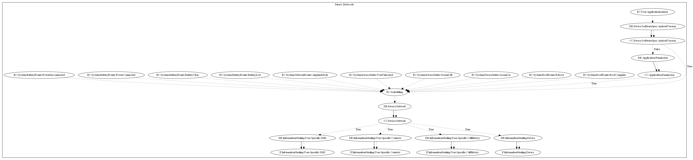

# GravityRAT

## High-level Description

* Year: 2020
* Blog: https://securelist.com/gravityrat-the-spy-returns/99097/

This malware sample aims to leak information of the user. It listens on application launch and a wide variety of system type events including categories: battery, network, device status, and boot. Once triggered, the malware periodically checks whether the network is available. It then collects SMS, contacts, call history, and device information and leaks each source to the malware developers server.

## Signature
---

The image of the signature can be downloaded [here](../../img/signatures/GravityRAT.png) for closer inspection.

