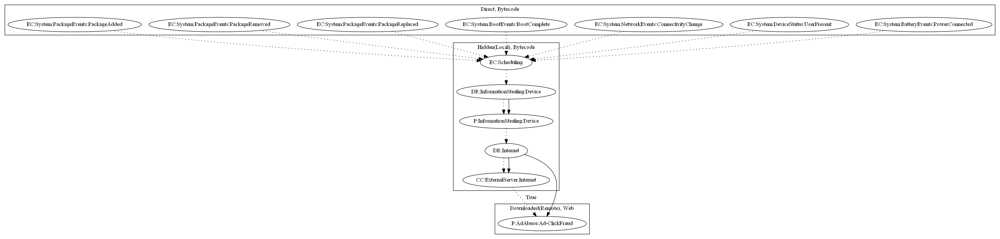

# GuerillaA

## High-level Description

* Year: 2018
* Blog: https://nakedsecurity.sophos.com/2018/05/10/watch-out-photo-editor-apps-hiding-malware-on-google-play/

This malware sample aims to perform ad-click fraud. It listens to a variety of package events (Package Added, Package Removed, Package Replaced), boot events (Boot Complete), device status (User Present), and battery events (Power Connected). The malware sample schedules a task to steal device information and retrieve ad configuration to perform ad-click fraud (an observed behavior, as the server was down).

## Signature
---

The image of the signature can be downloaded [here](../../img/signatures/GuerillaA.png) for closer inspection.

