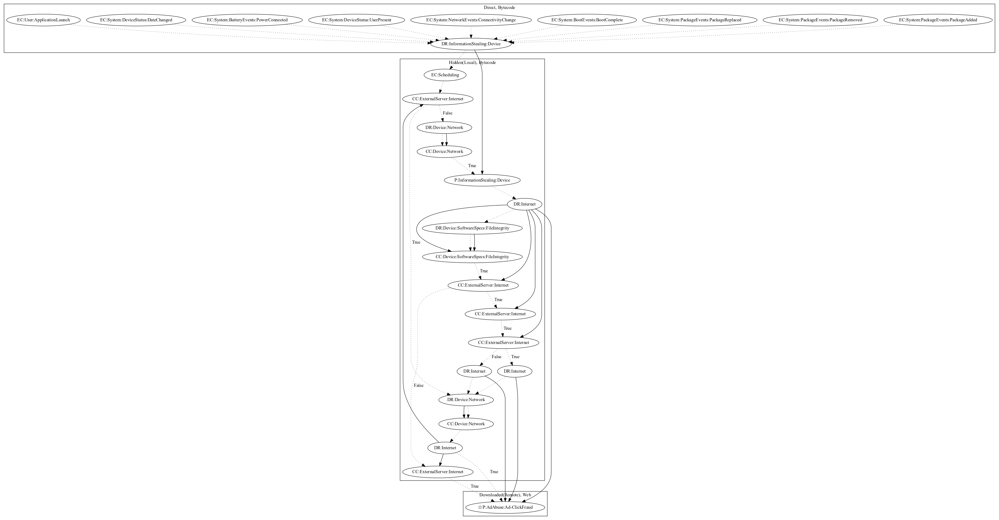

# GuerillaA

## High-level Description

* Year: 2018
* Blog: https://nakedsecurity.sophos.com/2018/05/10/watch-out-photo-editor-apps-hiding-malware-on-google-play/

This malware sample aims to perform ad-click fraud. It listens to a variety of package events, boot events, device status, and battery events. The malware sample schedules a task to steal device information and retrieve ad configuration. After checking network connection is available and several commands from the server, the malware dynamically loads the ad configuration retrieved from the internet and performs ad-click fraud (an observed behavior, as the server was down at time of analysis).

## Signature
---

The image of the signature can be downloaded [here](../../img/signatures/GuerillaA.png) for closer inspection.

