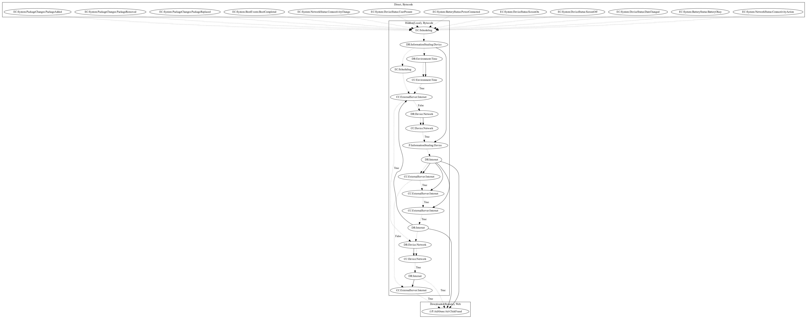

# GuerillaD

## High-level Description

* Year: 2018
* Blog: https://nakedsecurity.sophos.com/2018/05/10/watch-out-photo-editor-apps-hiding-malware-on-google-play/

This malware sample aims to perform ad-click fraud. It listens to a variety of package events, boot events, device status, network status, and battery events. The malware sample checks whether commands have been retrieved from the server. If not, it checks network connectivity before leaking device information and retrieving the commands. The malware checks the commands before retrieving additional payloads from the internet and performing ad-click fraud (an observed behavior, as the server was down at time of analysis).

## Signature
---

The image of the signature can be downloaded [here](../../img/signatures/GuerillaD.png) for closer inspection.

