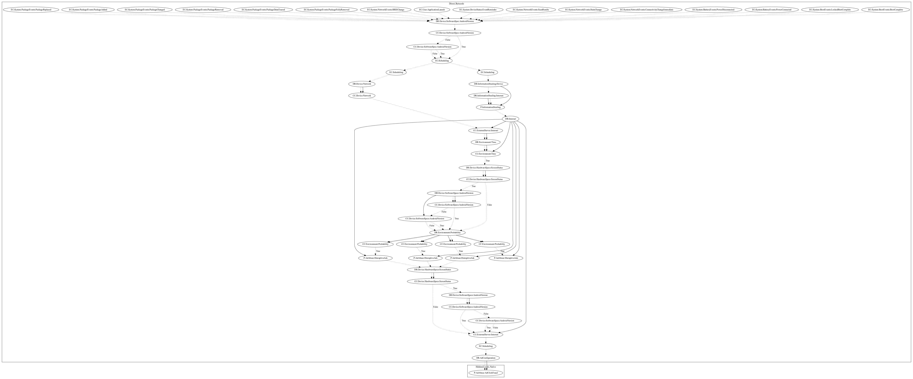

# Haken

## High-level Description

* Year: 2020
* Blog: https://research.checkpoint.com/2020/android-app-fraud-haken-clicker-and-joker-premium-dialer/

The malware sample aims to perform ad-click fraud. It listens on a wide variety of system-wide events to schedule two threads which: (1) contact the malware developers server for commands to push full screen ads, and (2) displays full screen ads and uses motion events to perform ad-click fraud.

## Signature
---

The image of the signature can be downloaded [here](../../img/signatures/Haken.png) for closer inspection.

