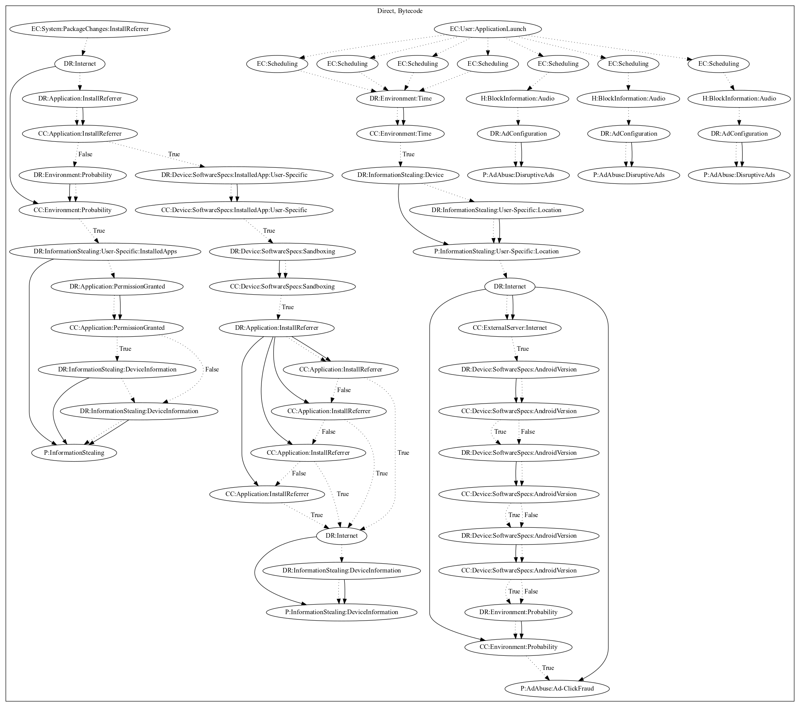

# Hiddad

## High-level Description

* Year: 2018
* Blog: https://blog.trendmicro.com/trendlabs-security-intelligence/android-wallpaper-apps-found-running-ad-fraud-scheme/

This malware sample aims to perform ad-click fraud and steal information from the user. The malware sample waits a period of time before scheduling seven routines on application launch. Four of the routines leak device and location information of the user, retrieve configuration from the server, and perform ad click fraud based on a probability roll configured by the configuration from the server. The remaining three routines attempt to push ads disruptively to the user. In addition, the malware contains capabilities to steal location or device information on install referrer system events. The malware leaks device and location information if the install referrer is a specific vendor, otherwise a probability roll determines whether information will be sent to the malware developers server.

## Signature
---

The image of the signature can be downloaded [here](../../img/signatures/Hiddad.png) for closer inspection.

