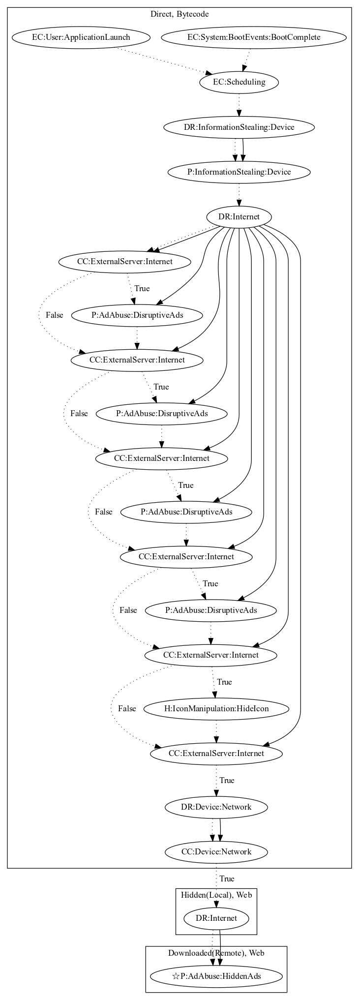

# HiddadAJN

## High-level Description

* Year: 2020
* Blog: https://www.welivesecurity.com/2020/05/11/breaking-news-app-promises-news-brings-ddos-attacks/

This malware sample aims to perform a variety of ad abuse payloads. The malware schedules an alarm on boot system events and application launch to steal device information and contact the malware developers server. Upon receiving commands, the malware can disruptively push ads to the user, hide the app icon, and load a local web file that retrieves a remote payload to perform hidden ads (an observed behavior, as the server was down at time of analysis).

## Signature
---

The image of the signature can be downloaded [here](../../img/signatures/HiddadAJN.png) for closer inspection.

