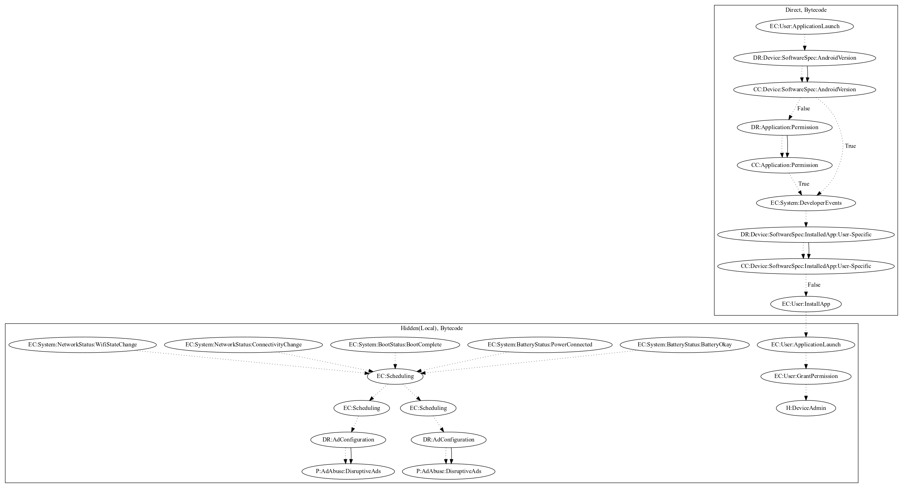

# HiddadBZ

## High-level Description

* Year: 2017
* Blog: https://www.welivesecurity.com/2017/03/08/aggressive-ad-displaying-google-play-app-tricks-users-leaving-high-ratings/

This malware application aims to push full screen ads to the user. The malware sample decrypts a local payload and attempts to entice the user to install the application. Upon installation, the local payload requests device admin privileges on launch. In addition, the malware registers network status, boot, and battery status events, that schedule two threads that disruptively push ads to the user.

## Signature
---

The image of the signature can be downloaded [here](../../img/signatures/HiddadBZ.png) for closer inspection.

