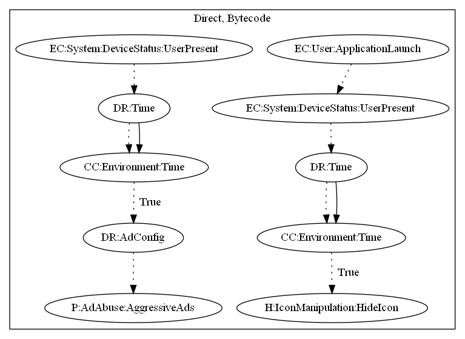

# HiddenAdGLCA

## High-level Description

* Year: 2019
* Blog: https://blog.trendmicro.com/trendlabs-security-intelligence/adware-campaign-identified-from-182-game-and-camera-apps-on-google-play-and-third-party-stores-like-9apps/

This malware application aims to push full screen ads to the user. The sample pushes full screen ads when the user unlocks the device. In addition, the malware is capable of hiding its icon after a certain time period after launching the application and unlocking the device.

## Signature
---

The image of the signature can be downloaded [here](../../img/signatures/HiddenAdGLCA.png) for closer inspection.

