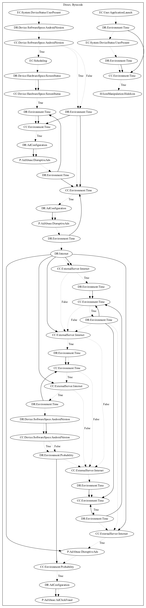

# HiddenAdGLCA

## High-level Description

* Year: 2019
* Blog: https://blog.trendmicro.com/trendlabs-security-intelligence/adware-campaign-identified-from-182-game-and-camera-apps-on-google-play-and-third-party-stores-like-9apps/

This malware application aims to perform ad abuse payloads. The malware hides the app icon on application launch after a set period of time has past. The malware also registers device status system events that check the screen status and time before pushing ads disruptively to the user. It further retrieves configuration from the internet and performs probability rolls to determine whether the malware should also attempt to click on the ads to perform ad-click fraud.

## Signature
---

The image of the signature can be downloaded [here](../../img/signatures/HiddenAdGLCA.png) for closer inspection.

