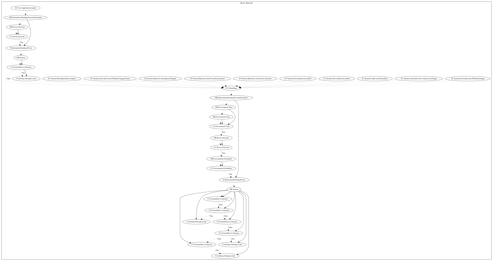

# HiddenAdHRXJA

## High-level Description

* Year: 2020
* Blog: https://www.trendmicro.com/en_us/research/20/f/barcode-reader-apps-on-google-play-found-using-new-ad-fraud-technique.html

This malware aims to perform ad abuse payloads. On application launch, the malware collects device information and leaks it to the malware developers server. It retrieves configuration and pushes an ad disruptively and starts a second path that attempts to periodically schedule ads. This path is also registered on a wide variety of system-wide boot, network, battery, device status, or call events. The malware waits a set period of time before checking the network and performing a probability roll. On success, the malware leaks device information to the malware developers server and retrieves commands as a result. It then pushes ads disruptively to the user depending on the commands.

## Signature
---

The image of the signature can be downloaded [here](../../img/signatures/HiddenAdHRXJA.png) for closer inspection.

