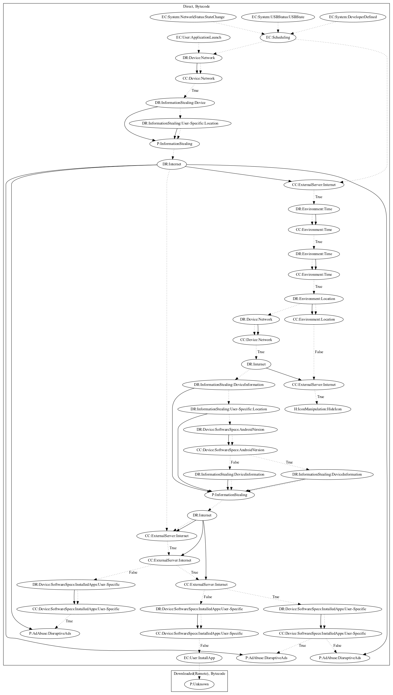

# HiddenAdOS

## High-level Description

* Year: 2020
* Blog: https://www.kaspersky.com/blog/minecraft-mod-adware-google-play/37717/

This malware sample aims to disruptively push ads to the user. The malware triggers on application launch and network, usb, or developer defined system events. The malware contains two threads that work together to perform the malicious payload. The malware leaks device and location information to the malware developers server and retrieves commands in the first thread. In a second thread, the malware checks the commands and hides the app icon if a command is set. Additionally, the thread leaks device and location information to retrieve additional configuration. The first thread uses the configuration retrieved from the second to push ads disruptively to the user and entice the user to install an additional application with an unknown payload.

## Signature
---

The image of the signature can be downloaded [here](../../img/signatures/HiddenAdOS.png) for closer inspection.

