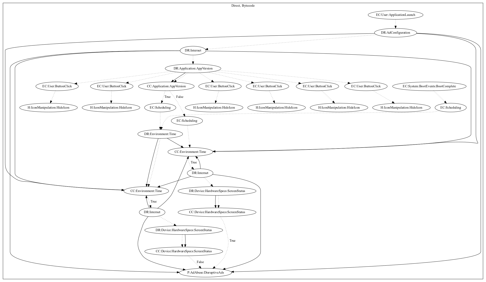

# HidenAd

## High-level Description

* Year: 2019
* Blog: https://blog.trendmicro.com/trendlabs-security-intelligence/adware-disguised-as-game-tv-remote-control-apps-infect-9-million-google-play-users/

This malware application aims to disruptively push ads to the user. On application launch, the malware retrieves configuration from the internet. The application acts as a tv streaming application with six buttons to view "channels". Once the user selects a channel, the application hides the app icon. Additionally, the malware checks the app version before periodically checking time to retrieve ad configuration from the internet. This behavior also occurs on boot system events. The malware then checks the screen status before pushing ads disruptively to the server.

## Signature
---

The image of the signature can be downloaded [here](../../img/signatures/HidenAd.png) for closer inspection.

